# Rsync UI

[](https://github.com/floriandejonckheere/rsync-ui/actions/workflows/ci.yml)


Rsync UI is a web application that lets you create, schedule, and execute file synchronization jobs with just a few clicks, powered by [rsync](https://github.com/RsyncProject/rsync).

## Highlights

- Dashboard for job health, activity, schedules, and storage
- Synchronization jobs for local and remote destinations
- Fully customizable command-line arguments
- Automation through scheduled jobs
- Remote server management with SSH key deployment and resource usage visibility
- Custom pre-/post-synchronization hooks
- Builtin customizable notifications
- Real-time synchronization progress
- SSH command auditing for security and compliance

## Screenshots

<a href="screenshots/dashboard.png">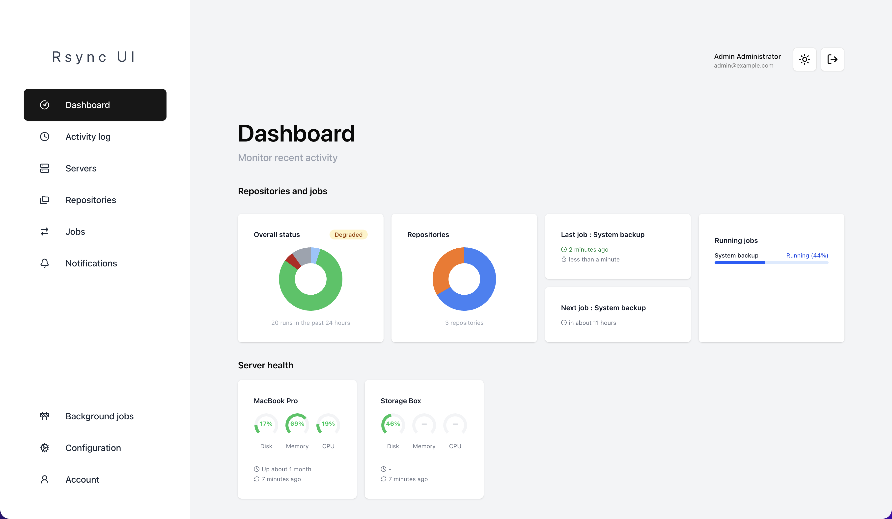</a>
<a href="screenshots/activity-log.png">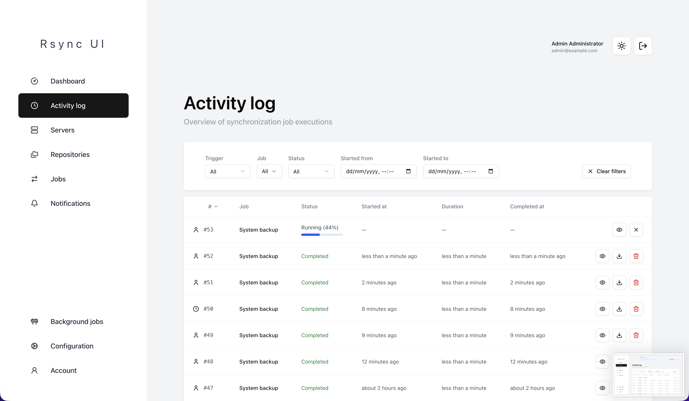</a>
<a href="screenshots/servers.png">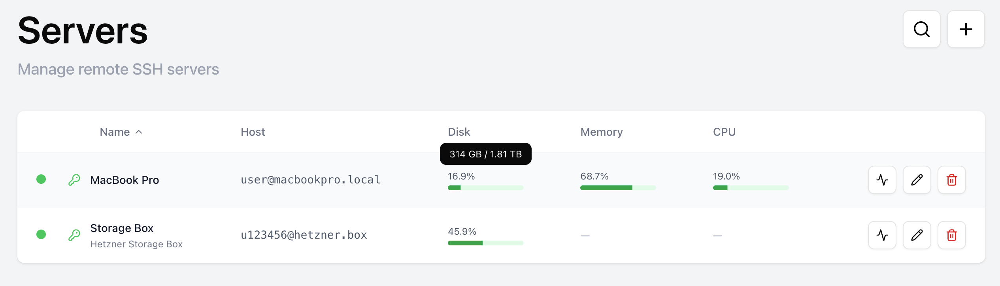</a>
<a href="screenshots/repositories.png">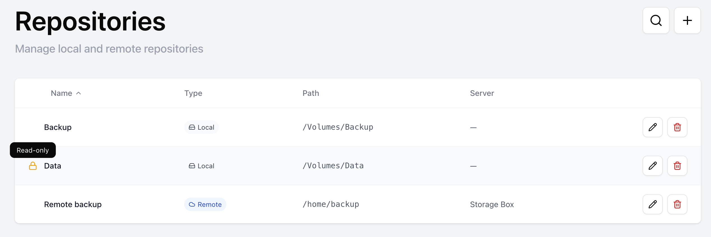</a>
<a href="screenshots/jobs.png">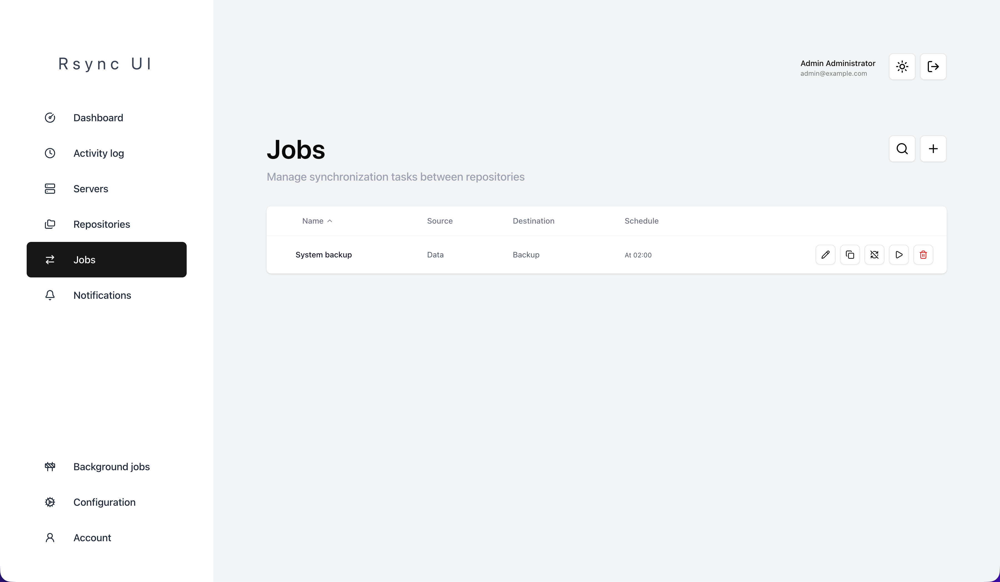</a>
<a href="screenshots/notifications.png">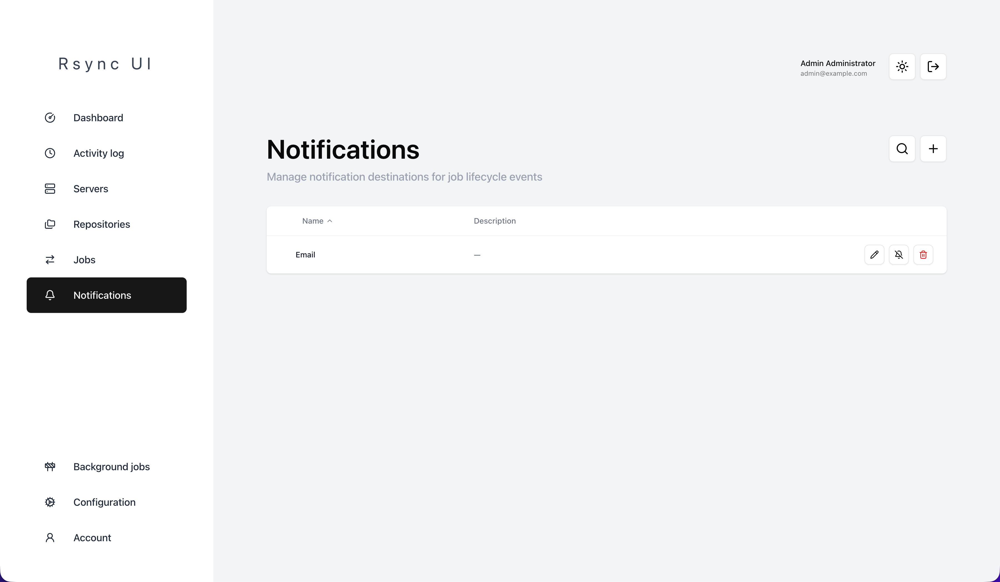</a>
<a href="screenshots/job.png">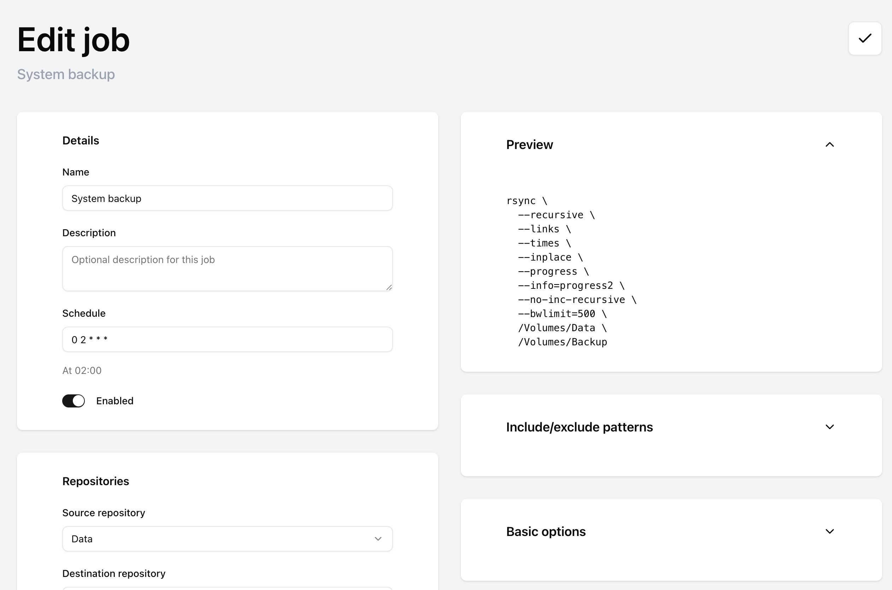</a>

<br />

<a href="screenshots/job-repositories.png">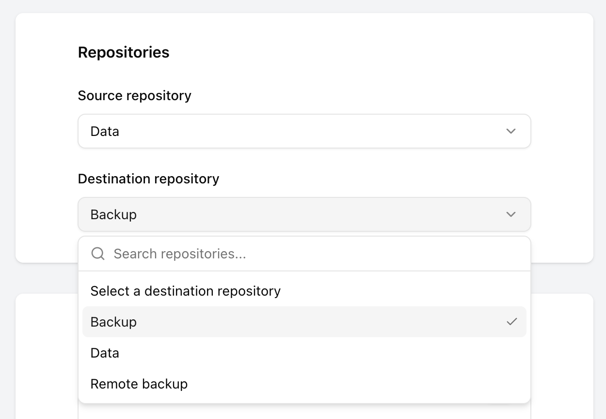</a>
<a href="screenshots/job-notifications.png">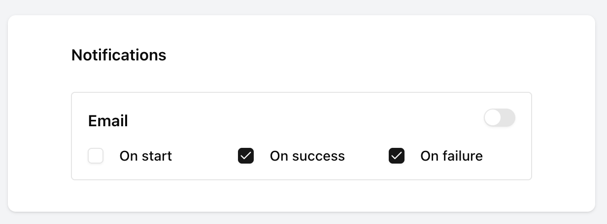</a>
<a href="screenshots/job-include-exclude.png">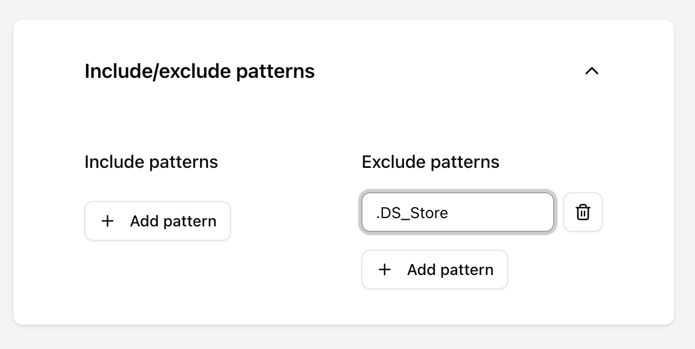</a>
<a href="screenshots/job-custom.png">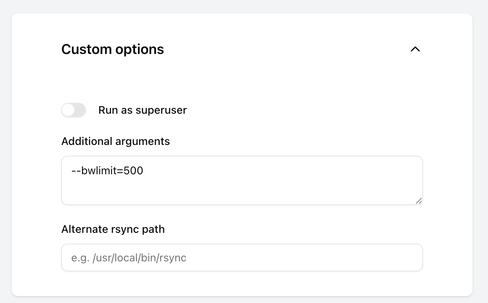</a>
<a href="screenshots/job-basic.png">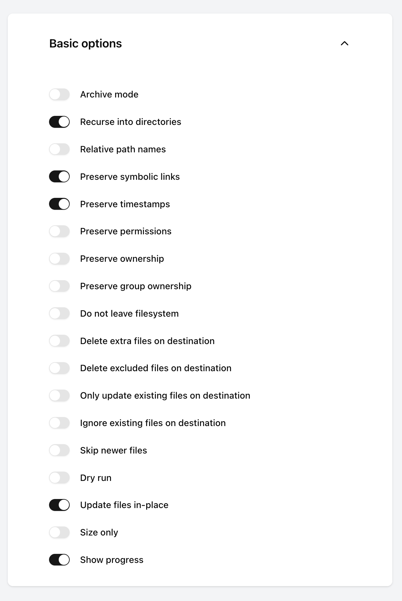</a>
<a href="screenshots/job-advanced.png">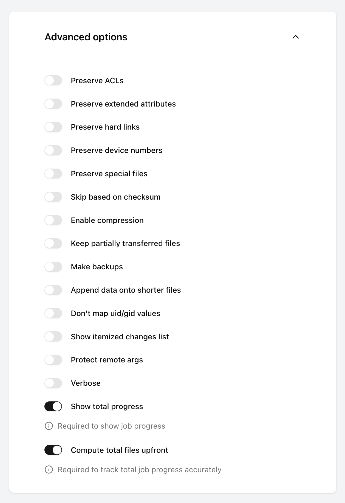</a>
<a href="screenshots/job-hooks.png">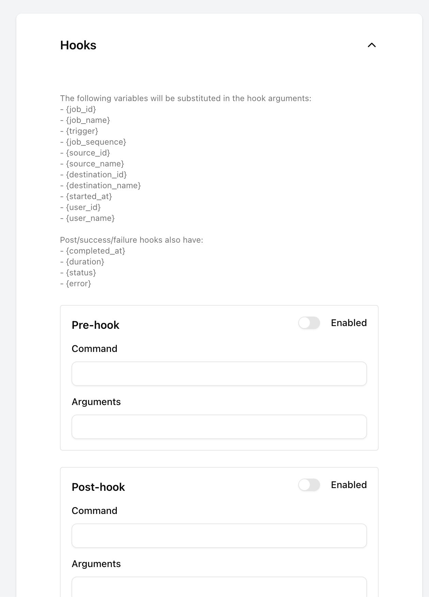</a>

> [!NOTE]
> Artificial Intelligence tooling is used during the development of this project. All generated code is thoroughly reviewed, tested, and verified manually to ensure the highest quality and security standards.

## Getting started

Rsync UI runs as a set of Docker containers. Docker compose is the recommended way to run the application.

```yml
x-app: &app
  image: ghcr.io/floriandejonckheere/rsync-ui:latest
  volumes:
    - rsync_ui:/app/storage/ # Directory for rsync logs
    - /path/to/storage:/data/storage:ro # Your local storage directories
    - /path/to/backup:/data/storage:rw # Your local storage directories
  environment:
    SECRET_KEY_BASE: my-secret # Application secret key
    ACTIVE_RECORD_ENCRYPTION_PRIMARY_KEY: my-secret # Encryption secret key
    ACTIVE_RECORD_ENCRYPTION_DETERMINISTIC_KEY: my-secret # Encryption secret key
    ACTIVE_RECORD_ENCRYPTION_KEY_DERIVATION_SALT: my-secret # Encryption secret key

    PG_HOST: postgres
    PG_USER: rsync_ui
    PG_PASSWORD: rsync_ui
    PG_DATABASE: rsync_ui

    APP_HOST: rsync-ui.example.com # URL of the application
    APP_EMAIL: rsync-ui@example.com # Email address of the application

    ADMIN_EMAIL: rsync-ui@example.com # Default admin account
    ADMIN_PASSWORD: rsync-ui # Default admin password
  depends_on:
    - postgres

services:
  web:
    <<: *app
    ports:
      - "3000:3000"

  worker:
    <<: *app
    command: bin/jobs

  postgres:
    image: postgres:18
    volumes:
      - postgres:/var/lib/postgresql/18/docker/
    environment:
      POSTGRES_USER: postgres
      POSTGRES_PASSWORD: postgres
    ports:
      - "5432:5432"

volumes:
  postgres:
  rsync_ui:
```

Generate secrets using `openssl rand -hex 32`.

### Docker compose

The easiest way to get started is to use Docker compose:

1. Install Docker and Docker compose
2. Clone the repository
3. Run `docker-compose up -d`
4. Open [http://localhost:3000](http://localhost:3000) in your browser

## Development

First, ensure you have a working Docker environment.

### Start the application

Pull the images and start the containers:

```
docker-compose up -d
```

Set up the PostgreSQL database:

```
docker-compose exec app bundle exec rails db:setup
```

Load sample data into the PostgreSQL database:

```
docker-compose exec app bundle exec rails database:seed
```

The application is now available at [http://localhost:3000](http://localhost:3000).

### Development environment

The development environment includes three fake SSH servers that simulate remote storage targets, seeded with realistic data so jobs can be run end-to-end without real infrastructure.

| Container | Script | Mount |
|-----------|--------|-------|
| `nas` | `docker/ssh/init-nas.sh` | `./tmp/data/nas` → `/data` |
| `backup` | `docker/ssh/init-backup.sh` | `./tmp/data/backup` → `/backup` |
| `mirror` | `docker/ssh/init-mirror.sh` | `./tmp/data/mirror` → `/backup` |

The app container stores all local repository data under `./tmp/data/app` (mounted to `/data`).

The following jobs are pre-seeded and can be run against these servers:

| Job | Source | Destination | Schedule |
|-----|--------|-------------|----------|
| Docker replica | `Docker` (local) | `Docker Replica` (local) | Every 5 minutes, disabled |
| Home backup | `Home` (local) | `Home backup` (Backup server) | Daily at 02:00 |
| Projects backup | `Projects` (local) | `Projects backup` (Backup server) | Daily at 02:00 |
| NAS photos sync | `NAS Photos` (NAS server) | `Photos` (local) | Weekly on Sunday at 03:00 |
| Photos mirror sync | `Photos` (local) | `Photos mirror` (Mirror server) | Weekly on Monday at 03:00 |

Source repositories are pre-populated with representative data. Destination repositories start empty and are filled when their job runs.

To reset all destination repositories back to their initial empty state, run from the project root:

```sh
docker/reset.sh
```

### Dependencies

Use the `bin/update` script to update your development environment dependencies.

### Debugging

Call `binding.break` anywhere in the source code to start a debugger.

### Testing

Run the test suite:

```
rspec
```

### Secrets

#### Repository secrets

Secrets for release and deployment:

- `GHCR_USER` (Github Container Registry username)
- `GHCR_TOKEN` (Github Container Registry token)

Create a [personal access token on GitHub](https://github.com/settings/tokens/new?description=Rsync+UI+(CI)&scopes=repo,write:packages).

Secrets for deployment:

- `SSH_HOST` (deployment host)
- `SSH_USER` (deployment user)
- `SSH_KEY` (private key)

#### Environment secrets

Secrets for deployment:

- `SECRET_KEY_BASE` (application secret)
- `ACTIVE_RECORD_ENCRYPTION_PRIMARY_KEY` (encryption secret)
- `ACTIVE_RECORD_ENCRYPTION_DETERMINISTIC_KEY` (encryption secret)
- `ACTIVE_RECORD_ENCRYPTION_KEY_DERIVATION_SALT` (encryption secret)

- `PG_HOST` (PostgreSQL host)
- `PG_USER` (database username)
- `PG_PASSWORD` (database password)

- `APP_HOST` (application hostname)
- `APP_EMAIL` (application email)

- `ADMIN_EMAIL` (administrator account email)
- `ADMIN_PASSWORD` (administrator account password)

- `POSTGRES_PASSWORD` (postgres user password, only for postgres container)

When adding more application environment variables, do not forget to add them in the following files, and on GitHub as environment secrets:

- `.development.env`
- `.github/workflows/cd.yml`
- `ops/compose.yml`

### Releasing

Update the changelog and bump the version in `lib/rsync_ui/version.rb`.
Create a tag for the version and push it to Github.
A Docker image will automatically be built and pushed to the registry.

```sh
nano lib/rsync_ui/version.rb
git add lib/rsync_ui/version.rb
git commit -m "Bump version to v1.0.0"
git tag v1.0.0
git push origin master
git push origin v1.0.0
```

## License

Copyright 2026 Florian Dejonckheere
